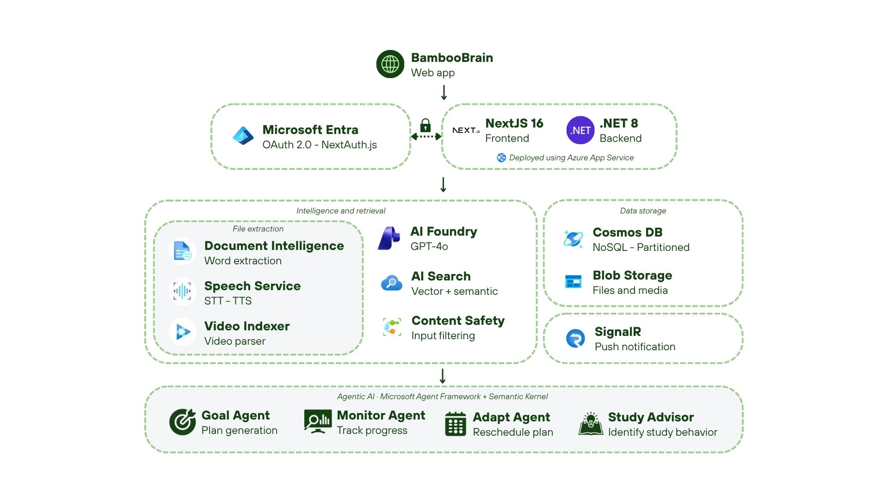

# BambooBrain Pavilion

BambooBrain is a Chinese learning agent built to help learners grow their Chinese and break every barrier. The idea behind this project is simple: learning Mandarin should not feel overwhelming, generic, or disconnected from real life. It should feel personal, intelligent, and adaptive.

With BambooBrain, learners can upload their own Chinese materials such as PDFs, videos, and audio, get instant vocabulary support, practice speaking with AI, and receive an automatically guided study journey. Instead of forcing learners into a fixed curriculum, BambooBrain creates a path that grows with them.

## Background

The problem BambooBrain addresses has three layers.

First, the language barrier is one of the hardest walls for foreigners to break. Mandarin is powerful and rewarding to learn, but it can also be intimidating because of characters, tones, vocabulary load, and the gap between textbook learning and real-world use.

Second, most traditional language apps still offer static content. Everyone gets the same lessons, the same progression, and the same exercises, regardless of their goals or environment.

Third, no app truly knows the learner. Most tools wait for the user to adapt to the system, when in reality the system should adapt to the learner.

## Vision

BambooBrain is designed to be a personal AI scholar that learns alongside the user. It treats language acquisition as something that should be adaptive, contextual, and alive.

Every feature in the product is guided by one central question: what does this specific learner need right now?

That means BambooBrain is not only helping users consume content. It is helping them build a personalized learning relationship with the language.

## Core Features

- Bring your own content: Upload Chinese PDFs, videos, and audio so learning starts with materials that are already relevant.
- Speaking practice with Master Ling AI: Practice Mandarin with natural responses and tone-aware feedback.
- Smart review with SM-2: Use spaced repetition so vocabulary appears at the right moment for retention.
- Guided planning: Follow a structured learning path paced for consistent progress.
- Always-available help: Ask questions at any time and get support when confusion happens.

## Why BambooBrain Is Different

What makes BambooBrain different is not only the feature list, but also the learning philosophy behind the product.

Most language apps give everyone the same content. BambooBrain gives every learner a different experience.

The more a learner uses BambooBrain, the more the system understands them. Uploaded materials become a personalized curriculum.

The AI is proactive. It does not wait for the learner to ask for help. It monitors progress, adapts the study path, and nudges the learner back on track when needed.

Most importantly, BambooBrain is built for real learners in real contexts. It is not centered on gamified streaks. It is centered on meaningful progress toward a real HSK target date and real-world Mandarin ability.

## Architecture

### High-Level System

- Frontend: Next.js 16 (App Router) + TypeScript + Tailwind CSS + NextAuth.js.
- Backend API: ASP.NET Core Web API (.NET 8), consumed via `NEXT_PUBLIC_API_URL`.
- Agent Layer: Microsoft Agent Framework (MAF) + Semantic Kernel powering Study Advisor behavior.
- Realtime: SignalR for notifications and live updates.

### Main Product Surfaces

- Dashboard: Stats, planner signals, and Study Advisor entry point.
- Library: Document ingestion and RAG-style chat over user-provided content.
- Planner: Adaptive study planning and schedule updates.
- Speaking: Conversation and speaking practice workflows.
- Study Center: Flashcards and quiz flows using spaced repetition.

### Chat Architecture (Two Different Systems)

- Study Advisor (`/api/advisor/chat`): Agentic assistant that can call tools (stats, plan, document search, adaptation, notification, vocabulary gap).
- RAG Chat (`/api/search/chat`): Retrieval-focused chat for document-grounded Q&A in the Library.

## Architecture Diagram



## Run Locally

### 1. Prerequisites

- Node.js 20+
- npm 10+ (or compatible package manager)
- Access to the BambooBrain backend API (local or deployed)

### 2. Install Dependencies

```bash
npm install
```

### 3. Configure Environment Variables

Create a `.env.local` file in the project root:

```bash
NEXT_PUBLIC_API_URL=http://localhost:5000
API_URL=http://localhost:5000
NEXTAUTH_URL=http://localhost:3000
NEXTAUTH_SECRET=replace-with-a-long-random-secret

# Optional OAuth providers
GOOGLE_CLIENT_ID=
GOOGLE_CLIENT_SECRET=
AZURE_AD_CLIENT_ID=
AZURE_AD_CLIENT_SECRET=
AZURE_AD_TENANT_ID=
```

Notes:

- `NEXT_PUBLIC_API_URL` is used by client-side API helpers.
- `API_URL` is used by some server-side routes as a fallback.
- OAuth values are optional unless you enable those sign-in methods.

### 4. Start the Development Server

```bash
npm run dev
```

Open <http://localhost:3000>.

### 5. Useful Commands

```bash
npm run dev    # start local development
npm run build  # production build
npm run start  # run production server
npm run lint   # run ESLint
```

## Project Structure

- `src/app`: App Router pages and API routes.
- `src/components`: Reusable UI and feature components.
- `src/lib`: API clients, auth config, and feature utilities.
- `src/types`: Shared TypeScript interfaces and models.
- `public/img`: Static images used in docs and UI.

## Notes

- This repository is the frontend (Pavilion) of BambooBrain.
- The backend API and agent orchestration services are external dependencies and must be running (or reachable) for full functionality.
